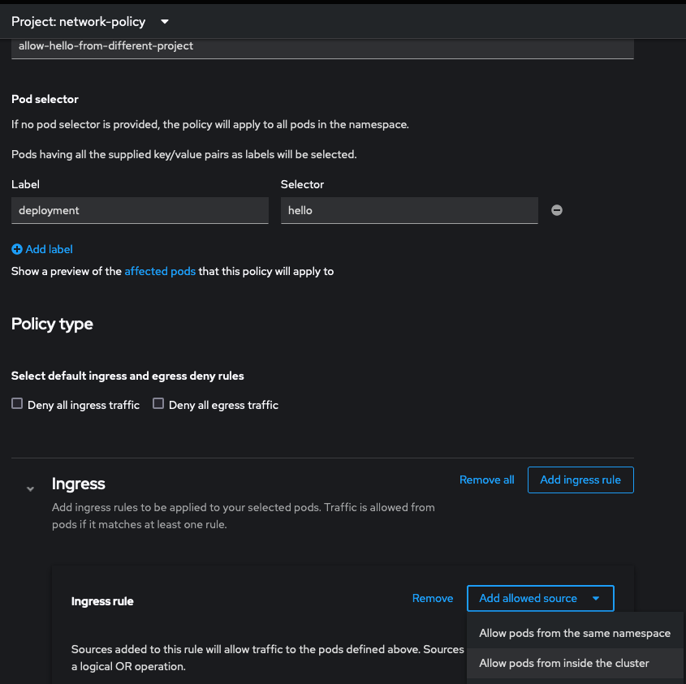
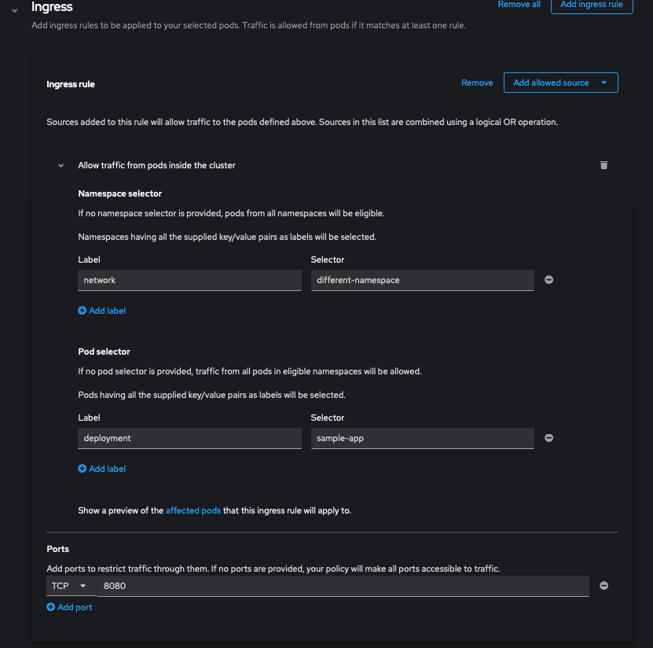

# Configure application security

This is an excercise where you configure security between pods.  

## Scenario A: Pods within a namespace/project can only talk to one another 
## Scenario B: Pods between namespaces/projects can talk to one another  

- create a project called `network-policy` 
- create two deployments/apps (`hello`, `test`) with the same image
```
oc new-app --name hello --image quay.io/redhattraining/hello-world-nginx  

oc new-app --name test --image quay.io/redhattraining/hello-world-nginx

```
- expose the hello service
```
❯ oc expose service/hello   
route.route.openshift.io/hello exposed

❯ curl hello-network-policy.apps-crc.testing                                    
<html>
  <body>
    <h1>Hello, world from nginx!</h1>
  </body>
</html>
```

- get wide output from pods,services,routes to get internal pod IP address and cluster IP addresses
```
❯ oc get pods,services,routes -o wide             
NAME                         READY   STATUS    RESTARTS   AGE   IP             NODE                 NOMINATED NODE   READINESS GATES
pod/hello-76bfc67544-ldwmj   1/1     Running   0          10m   10.217.0.171   crc-2zx29-master-0   <none>           <none>
pod/test-b4d8668db-b2l8s     1/1     Running   0          10m   10.217.0.172   crc-2zx29-master-0   <none>           <none>

NAME            TYPE        CLUSTER-IP     EXTERNAL-IP   PORT(S)    AGE   SELECTOR
service/hello   ClusterIP   10.217.5.160   <none>        8080/TCP   10m   deployment=hello
service/test    ClusterIP   10.217.4.111   <none>        8080/TCP   10m   deployment=test

NAME                             HOST/PORT                               PATH   SERVICES   PORT       TERMINATION   WILDCARD
route.route.openshift.io/hello   hello-network-policy.apps-crc.testing          hello      8080-tcp                 Nonee
```

- Access the `hello` pod from the `test` pod using `hello`'s pod and cluster IP
```
❯ oc rsh test-b4d8668db-b2l8s curl 10.217.0.171:8080
<html>
  <body>
    <h1>Hello, world from nginx!</h1>
  </body>
</html>

❯ oc rsh test-b4d8668db-b2l8s curl 10.217.5.160:8080
<html>
  <body>
    <h1>Hello, world from nginx!</h1>
  </body>
</html>
```
  
- create a second project called `different-project` and deploy the same image with the app name `sample-app`

```
❯ oc new-project different-project                                       
Now using project "different-project" on server "https://api.crc.testing:6443".

❯ oc new-app --name sample-app --image quay.io/redhattraining/hello-world-nginx
```
- access the `hello` pod from the `sample-app` pod via pod and cluster IP
```
❯ oc rsh sample-app-5fc755d58-bgbcc curl 10.217.0.171:8080                     
<html>
  <body>
    <h1>Hello, world from nginx!</h1>
  </body>
</html>

❯ oc rsh sample-app-5fc755d58-bgbcc curl 10.217.5.160:8080
<html>
  <body>
    <h1>Hello, world from nginx!</h1>
  </body>
</html>
```

- switch back to `network-policy` project and create a "deny-all" network policy
via GUI  (otherwise create yaml from scratch...good luck)
log in as leader  
switch to Adminstrator view  
Networking->NetworkPolicies  
 

Create Network Policy
call it `deny-all` and click Create


(yasl if you are inclned)
```
apiVersion: networking.k8s.io/v1
kind: NetworkPolicy
metadata:
  name: deny-all
  namespace: network-policy
spec:
  podSelector: {}
```
- test to make sure the pods cant access one another in the project (`test` trying to connect to `hello` pod and network IP)
```
❯ oc rsh test-b4d8668db-b2l8s curl 10.217.5.160:8080
^Ccommand terminated with exit code 130

❯ oc rsh test-b4d8668db-b2l8s curl 10.217.0.171:8080
^Ccommand terminated with exit code 130
```
- validate pod from `different-project` can no longer access `network-policy/hello`
```
❯ oc project different-project                                                 
Now using project "different-project" on server "https://api.crc.testing:6443".

❯ oc rsh sample-app-5fc755d58-bgbcc curl 10.217.0.171:8080                     
^Ccommand terminated with exit code 130
```

- switch back to `network-policy` project and create a policy that will allow `different-project/sample-app` to access pods

From Gui: Networking->NetworkPolicies->Create NetworkPolicy


resulting yaml
```
...(output omitted)
spec:
  podSelector:
    matchLabels:
      deployment: hello
  ingress:
    - ports:
        - protocol: TCP
          port: 8080
      from:
        - podSelector:
            matchLabels:
              deployment: sample-app
          namespaceSelector:
            matchLabels:
              kubernetes.io/metadata.name: different-project (note this comes from the label found in the "describe project <project name> command)
  policyTypes:
    - Ingress
```
- create lable `network=different-project` for project `different-project`

(as admin)
```
❯ oc login -u admin                                             

Using project "different-project".

❯ oc label namespace different-project network=different-project
namespace/different-project labeled
```  

- access the `hello` pod from the `sample-app` pod via pod and cluster IP 
```
oc rsh sample-app-5fc755d58-bgbcc curl 10.217.0.171:8080 
<html>
  <body>
    <h1>Hello, world from nginx!</h1>
  </body>
</html>
```
  
  
  [back to main](./README.md) 
