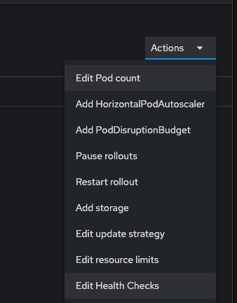
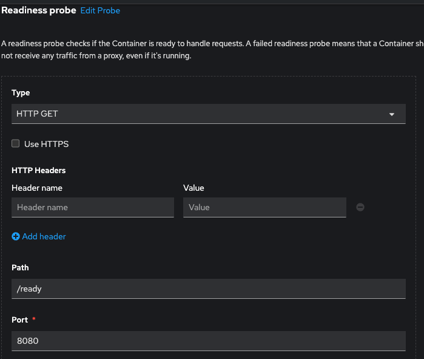
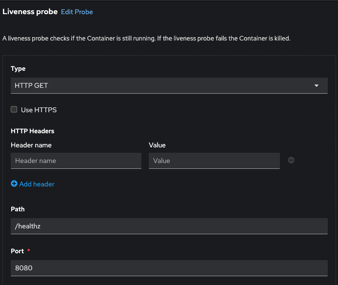

# Configure applications for reliability

This excercise assumes you have an application with existing readyness and health endpoints.  
I found a project that can be deployed with this functionality

- Create new project and deploy application
```
oc new-project health-and-readyness                                          
Now using project "health-and-readyness" on server "https://api.crc.testing:6443".

oc new-app \
--name probes --context-dir probes --build-env \
npm_config_registry=http://nexus-common.apps.na410.prod.nextcle.com/repository/nodejs \
nodejs:16-ubi8~https://github.com/tsrana/DO288-apps
```  

Wait for app to start  (can take > 4 minutes in CRC)

```
oc get pods                                                                                       llevy-mac: 

NAME                          READY   STATUS      RESTARTS   AGE
pod/probes-1-build            0/1     Completed   0          7m40s
pod/probes-5f84f4b7f9-jschr   1/1     Running     0          6m29s
```

Expose service and test the `ready` and `healthz` endpoints
```
❯ oc expose service/probes  
route.route.openshift.io/probes exposed

❯ curl probes-health-and-readyness.apps-crc.testing                                     
Hello! This is the index page for the app.

❯ curl probes-health-and-readyness.apps-crc.testing/ready
Ready for service requests...

❯ curl probes-health-and-readyness.apps-crc.testing/healthz
OK

❯ curl probes-health-and-readyness.apps-crc.testing/ready -i
HTTP/1.1 200 OK
x-powered-by: Express
content-type: text/html; charset=utf-8
content-length: 30
etag: W/"1e-ANVsNjd6wx5bS7ZhAUO+mQ"
date: Fri, 08 Sep 2023 17:34:28 GMT
keep-alive: timeout=5
set-cookie: fbc6880d0c2a839105b7441f06647354=d910f70e9695219c85a4bb38b9f325f7; path=/; HttpOnly
cache-control: private

Ready for service requests...

❯ curl probes-health-and-readyness.apps-crc.testing/healthz -i
HTTP/1.1 200 OK
x-powered-by: Express
content-type: text/html; charset=utf-8
content-length: 3
etag: W/"3-02+PlCXEqAAK2cSpcYWspQ"
date: Fri, 08 Sep 2023 17:34:34 GMT
keep-alive: timeout=5
set-cookie: fbc6880d0c2a839105b7441f06647354=d910f70e9695219c85a4bb38b9f325f7; path=/; HttpOnly
cache-control: private

OK
```

- Add health and readyness probes to deployment  
From web console
Deployments->Action-Edit Health Checks


add readyness probe with the `/ready` Path and click the check mark


add the livelyness probe with the `/healthz` Path and click the check mark

  
CLick [Save]  
App will redeploy with probes

```
oc describe deployment probes 
Name:                   probes
Namespace:              health-and-readyness
...
Pod Template:
  Labels:       deployment=probes
  Annotations:  openshift.io/generated-by: OpenShiftNewApp
  Containers:
   probes:
    Image:        image-registry.openshift-image-registry.svc:5000/health-and-readyness/probes@sha256:a1ae413af592e1cde5bb573b25ac0f3cfc4fc6ed5ff01a4ede4e381a0a1131e8
    Port:         8080/TCP
    Host Port:    0/TCP
    Liveness:     http-get http://:8080/healthz delay=0s timeout=1s period=10s #success=1 #failure=3
    Readiness:    http-get http://:8080/ready delay=0s timeout=1s period=10s #success=1 #failure=3
...
```

Test probes by going to the url  
`http://probes-health-and-readyness.apps-crc.testing/flip?op=kill`

This will put the app in an unhealthy state and it will redeploy in a few seconds.  
Monitor with the `watch oc get pods` command


command line opertions
```
$ oc set probe deployment probes --liveness \
--get-url=http://:8080/healthz \
--initial-delay-seconds=2 --timeout-seconds=2

deployment.apps/probes probes updated

$ oc set probe deployment probes --readiness \
--get-url=http://:8080/ready \
--initial-delay-seconds=2 --timeout-seconds=2
```

  [back to main](./README.md) 