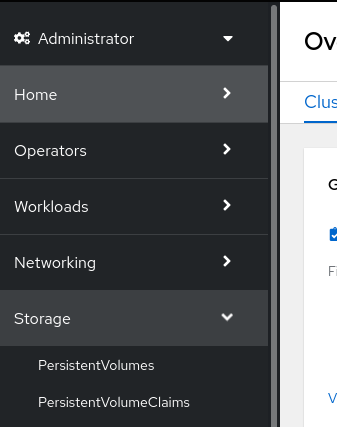
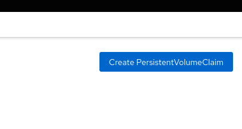

# Manage storage for application configuration and data

- Create a project called `storage-test`

- Create new app called `storage-test-app`

`$ oc new-app --name storage-test-app --image quay.io/redhattraining/hello-world-nginx`  
  
- We will be using a given NFS storage filer (IP address-based)

- Create a PV in the following format

```
apiVersion: v1
kind: PersistentVolume
metadata:
  name: pv0001 
spec:
  capacity:
    storage: 1Gi 
  accessModes:
  - ReadWriteOnce 
  nfs: 
    path: /
    server: 172.17.0.2 
  persistentVolumeReclaimPolicy: Retain 
```
[from documentation](https://docs.openshift.com/container-platform/4.10/storage/persistent_storage/persistent-storage-nfs.html). 

- It is easy to do this with the GUI, otherwise, you need to create a yaml file from scratch
Storage->PersistentVolumeClaims

  
Create PersistenVolumeClaim that binds to the created PV


Fill out form with the following info
```
PersistentVolumeClaim name: storage-test-pvc
Access mode: Single user (RWO)
Size: 1Gi
Volume mode: Filesystem
```

Note that to ensure the PVC binds to the correct PV, you need to add the `volumeName` tag to the yaml

yaml looks like this
```
apiVersion: v1
kind: PersistentVolumeClaim
metadata:
  name: storage-test-pvc
spec:
  accessModes:
    - ReadWriteOnce 
  resources:
    requests:
      storage: 1Gi 
  volumeName: pv0001  <--------- VERY IMPORTANT!!!!!
  storageClassName: ""
```
[from documentation](https://docs.openshift.com/container-platform/4.10/storage/persistent_storage/persistent-storage-nfs.html). 


- add PVC to storage-test-app deployment
(Using GUI)  
  
From the deployment:  
`Actions->Add storage`  

```
(0)Use existing claim: storage-test-pvc

Mount path: /mnt/storage-test

[Save]
``` 

App will redeploy 

- log into pod and test storage

```
$ oc rsh storage-test-app-54bdc95c84-tq4zx /bin/bash
bash-4.4$ ls /mnt
storage-test

$ echo "hello">/mnt/storage-test/hello.txt

$ cat /mnt/storage-test/hello.txt 
hello
```
- delete pod, and log into the new pod to make sure the hello.txt file still exists

```
$ oc delete pod storage-test-app-54bdc95c84-tq4zx 
pod "storage-test-app-54bdc95c84-tq4zx" deleted

$ oc get pods
NAME                                READY   STATUS    RESTARTS   AGE
storage-test-app-54bdc95c84-sllnm   1/1     Running   0          12s

$ oc rsh storage-test-app-54bdc95c84-sllnm cat /mnt/storage-test/hello.txt
hello
```

...

The above is very simple, but if only given a storageclass and nothing else, and dynamically provisioned PVs isn't available in your environment, look at information around it's FQDN/IP and mount point, and create a static pv with that information first, and get the PVC to point to it. Make sure your PVC spec includes the `storageClassName` tag.
  
  [back to main](./README.md) 
