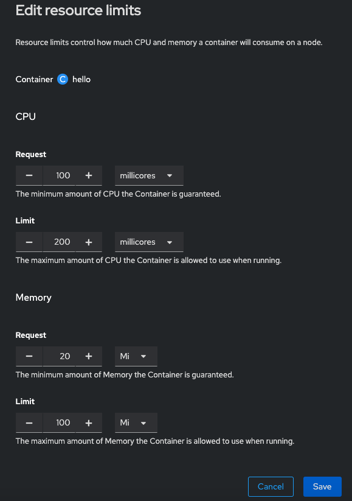

# Quotas - Resource Limits - Scale - Autoscale

- Deploy hello-nginx app to test with in project limits-scale
```
❯ oc new-project limits-scale        

❯ oc new-app --name hello --image quay.io/redhattraining/hello-world-nginx
```

- scale deployment to 2 pods
```
❯ oc scale deployment hello --replicas 2                                  
deployment.apps/hello scaled

❯ oc get pods                           
NAME                     READY   STATUS    RESTARTS   AGE
hello-76bfc67544-9tf98   1/1     Running   0          2m15s
hello-76bfc67544-xzpkl   1/1     Running   0          7s
```

- Create an autoscale policy so that the deployment has a minimum 2 pods and a max of 4 pod and scales when cpu is over 75%  
```
❯ oc autoscale deployment hello --min 2 --max 4 --cpu-percent 75
horizontalpodautoscaler.autoscaling/hello autoscaled

❯ oc get horizontalpodautoscalers.autoscaling 
NAME    REFERENCE          TARGETS         MINPODS   MAXPODS   REPLICAS   AGE
hello   Deployment/hello   <unknown>/75%   2         4         2          82s
```

- Create resource limits for deployment  
[] request cpu 100m  
[] limit cpu 200m  
[] request memory 20Mi  
[] limit cpu 100Mi  

easiest way is to edit this via the web console from the deployment (`Actions->Edit Resource Limits`)  
  
  
(note: if app isnt running due to cpu request exeeded, lower request ammount)  
  
- Create quota: `cpu 3`, `memory 1G`, `configmaps 2` in the curent project
  
login as admin
```
❯ oc create quota project-quota --hard=cpu=3,memory=1Gi,configmaps=2 -n limits-scale 
resourcequota/project-quota created

❯ oc get quota                                                                      
NAME            AGE   REQUEST                                          LIMIT
project-quota   12m   configmaps: 2/2, cpu: 200m/3, memory: 40Mi/1Gi   
```

  [back to main](./README.md) 